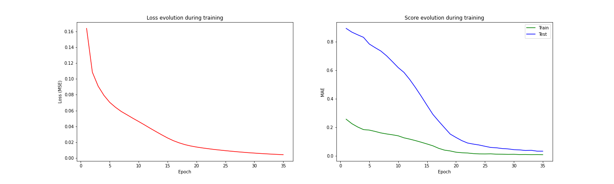

# Financial time series forecasting with transformers

## Introduction

The aim of the project is to investigate the use of the Transformer model (in two versions) in financial time series forecasting and evaluate its performance against a classical recurrent neural network, in particulat the LSTM model. Two versions of the Transformer are used with two different approaches for the forecasting:

- **Transformer Decoder**: based on the GPT-3 structure, only the decoder part of the [original architecture](https://arxiv.org/abs/1706.03762) is used, working with a self-supervised approach, the model is fed with an input time series of length L and it has to forecast the next value, giving in output a time series of length L, which has to be the input shifted to right by 1;
- **Transformer**: in this case the whole [original architecture](https://arxiv.org/abs/1706.03762) is used with the classical approach of the transformer, the encoder is fed with a time series of length L, while the decoder is fed with a time series of lenght T which is the target shifted to left by 1. The model gives in output a time series of length T that is the target.

The project has been developed as part of the course ["School in AI: Deep Learning, Vision and Language for Industry"](https://aischools.it/).

## Dataset

The dataset used is taken from Yahoo Finance and it contains the *Open*, *High*, *Low*, *Close*, *Adj Close* and *Volume* values of S&P 500 index for each days from 29-01-1993 to 06-10-2022. For the goal of this project only the *Close* feature is used in order to obtain **univariate time series**.
To normalize the data the min max scaling is used, fitted on the train set and then applied also to the test set. The evaluation metrics then are computed on the scaled data, while in order to plot the forecasting with the correct values an inverse scaling is  applied before plotting.

## Training

The training is performed in the ```experiment.py``` file, for each model hyperparameter optimization is performed and during the run the results are saved in the respective directories. The optimal hyperparamters are listed below.
For each model:

- batch size = 64;
- input time series length = 90;
- trainset split = 70%
- testset split = 30%
- loss function = Mean Squared Error
- optimizer = Adam

### Transformer decoder best values

- learning rate = 1e-05
- number of decoders = 1
- dimension of the model (feature size) = 128
- number of heads = 8
- dropout = 0
- dimension of the fully connected inside the decoder = 256
- positional encoding = classical sinusoidal encoding

### Transformer best values

- output time series length = 30
- learning rate = 1e-05
- number of encoders = 1
- number of decoders = 1
- dimension of the model (feature size) = 128
- number of heads = 8
- dropout = 0
- dimension of the fully connected inside the decoder = 256
- positional encoding = classical sinusoidal encoding

### LSTM best values

- learning rate = 1e-05
- number of layers = 2
- dimension of the hidden states = 64
- dropout = 0

After the training each model is tested on the test set with a forecast length of 30 days and the forecast is plotted against the ground truth and saved to file.
To evaluate the performance the *Mean Absolute Error* and the *Mean Absolute Percentage Error* is measured.

## Results

### Training results

|                   | Transformer Decoder | Transformer | LSTM    |
|:-----------------:|:-------------------:|:-----------:|:-------:|
| loss value (MSE)  | 0.00010             | 0.00012     | 0.00217 |
| train score (MAE) | 0.00712             | 0.00768     | 0.03323 |
| test score (MAE)  | 0.08099             | **0.07480** | 0.27325 |

*Transformer decoder training*:


*Transformer training*:


*LSTM training*:


### Testing results

|            | Transformer Decoder | Transformer | LSTM    |
|:----------:|:-------------------:|:-----------:|:-------:|
| MAE score  | 0.34848             | **0.07524** | 0.49090 |
| MAPE score | 0.15952             | **0.03263** | 0.31760 |

The results show that the Transformer model is the best one, it performs an order of magnitude better with respect to others.
Some examples of Transformer forecasting from the test set:


## Usage

Clone the repository:
```git clone https://github.com/francescobaraldi/time-series-forecasting-with-transformers.git```

Install the dependencies:
```pip install -r requirements.txt```

Then it is possible to execute the main file which runs the three models tested in order to forecast the next 30 days closing price of the S&P 500 index:
```python main.py```
The results will be plotted and saved in the directory ```inference_results/``` in png format, one image for each model tested.

It is also possible to experiment with the models, in the ```experiment.py``` file there is the code to train the models and it's possible to try with different hyper parameters, different lengths of the input time series and output time series. The notebook version of the file allows to run the code in [Google Colab](https://colab.research.google.com/).

## References

- [Attention Is All You Need - Ashish Vaswani, Noam Shazeer, Niki Parmar, Jakob Uszkoreit, Llion Jones, Aidan N. Gomez, Lukasz Kaiser, Illia Polosukhin](https://arxiv.org/abs/1706.03762)
