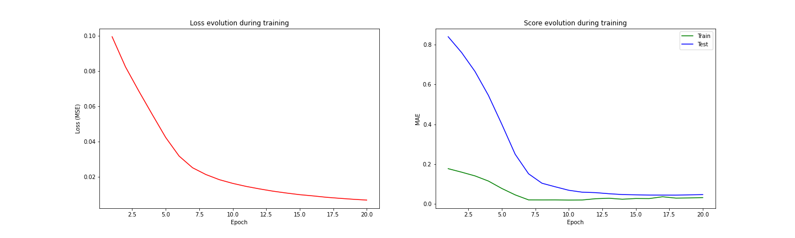
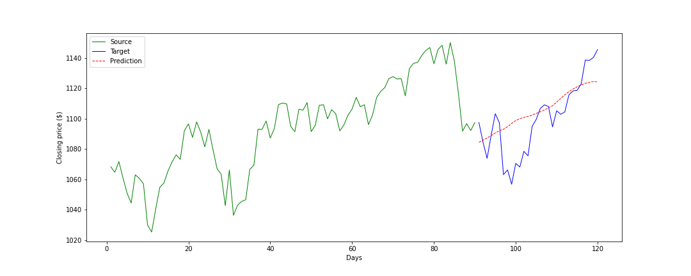
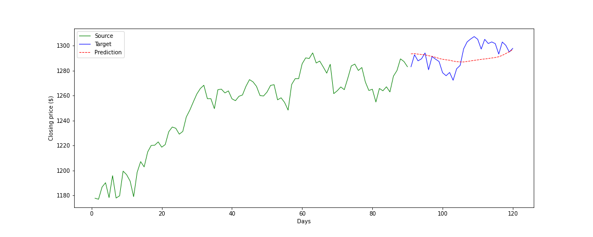

# Financial time series forecasting with transformers

## Introduction

The aim of the project is to investigate the use of the Transformer model (in two versions) in financial time series forecasting and evaluate its performance against a classical recurrent neural network, in particular the LSTM model. Two versions of the Transformer are used with two different approaches for the forecasting:

- **Transformer Decoder**: based on the GPT-3 structure, only the decoder part of the [original architecture](https://arxiv.org/abs/1706.03762) is used, working with a self-supervised approach, the model is fed with an input time series of length L and it has to forecast the next value, giving in output a time series of length L, which has to be the input shifted to right by 1;
- **Transformer**: in this case the whole [original architecture](https://arxiv.org/abs/1706.03762) is used with the classical approach of the transformer, the encoder is fed with a time series of length L, while the decoder is fed with a time series of lenght T which is the target shifted to left by 1. The model gives in output a time series of length T that is the target.

The project has been developed as part of the course ["School in AI: Deep Learning, Vision and Language for Industry"](https://aischools.it/).

## Dataset

The dataset used is taken from [Kaggle](https://www.kaggle.com/datasets/benjibb/sp500-since-1950) and it contains the *Open*, *High*, *Low*, *Close*, *Adj Close* and *Volume* values of S&P 500 index for each days from 03-01-1950 to 06-06-2018. For the goal of this project only the *Close* feature is used in order to obtain **univariate time series**.
To normalize the data the min max scaling is used, fitted on the training set and then applied also to the test set. The evaluation metrics then are computed on the scaled data, while in order to plot the forecasting with the correct values an inverse scaling is  applied before plotting.

## Training

The training is performed in the `experiment.py` file, dropout and L2 regularization is applied in order to avoid overfitting, so the *dropout* parameter of the models is set with a specific value, and the L2 regularization is applied setting the *weight_decay* parameter of the Adam optimizer. For each model is performed an hyperparameter optimization and during the run the results are saved in the respective directories. The optimal hyperparamters obtained are listed below.

### For each model

- batch size = 64;
- input time series length = 90;
- training set split = 80%
- test set split = 20%
- loss function = Mean Squared Error
- optimizer = Adam

### Transformer decoder best values

- learning rate = 5e-06
- weight decay = 1e-06
- number of decoders = 1
- dimension of the model (feature size) = 128
- number of heads = 8
- dropout = 0.03
- dimension of the fully connected inside the decoder = 256
- positional encoding = classical sinusoidal positional encoding

### Transformer best values

- output time series length = 30
- learning rate = 5e-06
- weight decay = 1e-06
- number of encoders = 1
- number of decoders = 1
- dimension of the model (feature size) = 128
- number of heads = 8
- dropout = 0.08
- dimension of the fully connected inside the decoder = 256
- positional encoding = learnable positional encoding

### LSTM best values

- learning rate = 1e-05
- weight decay = 1e-05
- number of layers = 2
- dimension of the hidden states = 64
- dropout = 0.05

## Testing

Since the models are trained to forecast the single next value of the time series given in input, the process of forecasting N future steps is composed by N steps: the model forecast the single next value, that is considered correct and then it's appended to the original input, which is fed to the model. By iterating this process N times we will obtain N future values.
After the training phase, each model is tested on the test set in the way explained so far, with a forecast length of 30 days and the forecast is plotted against the ground truth and saved to file.
To evaluate the performance the *Mean Absolute Error* and the *Mean Absolute Percentage Error* is measured on this 30 days window.

## Results

### Training results

The following table shows the results of the training phase, it's important to notice that here the metrics' scores are based on the forecasting of the single next value of the time series and not on the forecasting of N future steps.

|                   | Transformer Decoder | Transformer | LSTM    |
|:-----------------:|:-------------------:|:-----------:|:-------:|
| loss value (MSE)  | 0.00419             | 0.00689     | 0.00021 |
| train score (MAE) | 0.00859             | 0.03237     | 0.00860 |
| test score (MAE)  | 0.03317             | 0.04728     | 0.14154 |

*Transformer decoder training*:


*Transformer training*:


*LSTM training*:


### Testing results

The following table shows the results of the testing phase, here the metrics' scores are computed on the forecasting of the next 30 days in the future, following the process descrbied in the [Testing section](#testing).

|            | Transformer Decoder | Transformer | LSTM    |
|:----------:|:-------------------:|:-----------:|:-------:|
| MAE score  | 0.05773             | 0.05506     | 0.16314 |
| MAPE score | 0.05681             | 0.06527     | 0.12568 |

The results show that both the Transformer Decoder and the Transformer models reach very similar performance, they perform an order of magnitude better with respect to the LSTM model.

Some examples of Transformer Decoder forecasting from the test set:


Some examples of Transformer forecasting from the test set:



Some examples of LSTM forecasting from the test set:


As the plots show, the models are able to approximate quite well the general evolution of the forecast window, while the small variations are not modeled very well.

## Usage

Clone the repository:

```bash
git clone https://github.com/francescobaraldi/time-series-forecasting-with-transformers.git
cd time-series-forecasting-with-transformers
```

Install the dependencies:

```bash
pip install -r requirements.txt
```

Then it is possible to execute the main file which runs the three models in order to forecast the closing price of the next 30 days of the S&P 500 index:

```bash
python main.py
```

The results will be plotted and saved in the directory `inference_results/` in png format, one image for each model tested.

It is also possible to experiment with the models, in the `experiment.py` file there is the code to train the models and it's possible to try with different hyper parameters, different lengths of the input time series and output time series. The notebook version of the file allows to run the code in [Google Colab](https://colab.research.google.com/).

## References

- [Attention Is All You Need - Ashish Vaswani, Noam Shazeer, Niki Parmar, Jakob Uszkoreit, Llion Jones, Aidan N. Gomez, Lukasz Kaiser, Illia Polosukhin](https://arxiv.org/abs/1706.03762)
- [Kaggle dataset used](https://www.kaggle.com/datasets/benjibb/sp500-since-1950)
